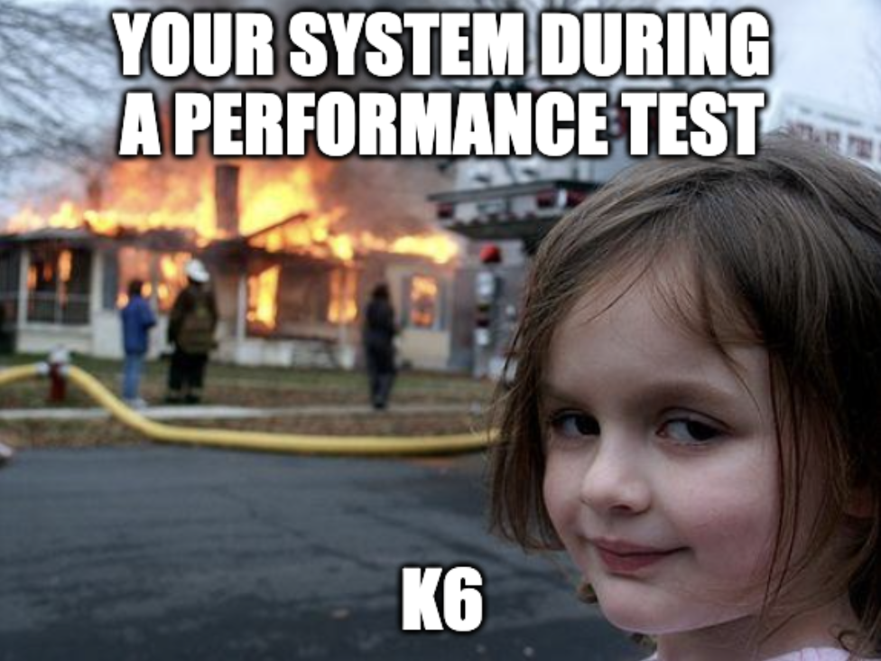

# Introduction to K6 Testing
Have you ever wondered where you can get enough friends to test your application all at the same time? 
Well, fear not because K6 is the only friend you'll need!
In this article I'm going to teach you how to become a K6 wizard! 🧙

I will show you why it's used and how to setup/use it to test your application.
I will explain what K6 is, what Load Testing is and the different types of testing that can be done with K6.

## What is this K6 Magic? 🪄 

K6 or Grafana K6 is an open-source load testing tool that makes it easy to performance test your application making you a more productive developer.
With K6 you can run a variety of different types of load tests while monitoring the performance of your application continuously.
You can simulate different traffic to see how your application performs in a varienty of scenarios.

## Testing types 🧪 



With K6 there are a varienty of supported testing methods like Load Testing, Spike Testing & Soak Testing. The results of each type of testing will give different insights about your system & how it performs allowing you the developer to improve your system.

`Load Testing` 🏋️ is all about bullying your application with alot of concurrent users/requests and monitoring your system's suffering.

`Spike Testing` 📈 doesn't casually increase the load on your system, it gives your application a mini heart attack by throwing a large load at the system in a short period of time. Did I say this happens multiple times? Talk about cruelty!

Unlike what the name might suggest your system does not get to relax in a warm bath, instead `Soak Testing` 🛀 places your system under constant load for an extended period of time so that you can see how reliable your system is and how it might perform over long periods of time under load.

## Advantages of K6 💪

K6 has many advantages like the fact that it uses a minimal amount of system resources (ie: RAM, CPU, HDD/SSD) to conduct extensive tests on your system.

K6 provides excellent monitoring options to observe on your system while it's hard at work.  

## Some Limitations 🚧

We all have our limits and K6 is no exception since it was created by human beings like you and I (assuming you're human).

K6 unfortunately doesnt display web pages the same way that a browser might. This means that if your system uses libraries that use some kind of browser APIs, those will not be compatible. However, because of this K6 has greatly improved performance as it consumes less resources.

## Setting up K6

Right, now the fun bit. Let's get you up and running with K6. What do you need? Well first we need to install it, how we do that depends on your operating system.

Linux (Debian/Ubuntu)
```sh
sudo gpg --no-default-keyring --keyring /usr/share/keyrings/k6-archive-keyring.gpg --keyserver hkp://keyserver.ubuntu.com:80 --recv-keys C5AD17C747E3415A3642D57D77C6C491D6AC1D69
echo "deb [signed-by=/usr/share/keyrings/k6-archive-keyring.gpg] https://dl.k6.io/deb stable main" | sudo tee /etc/apt/sources.list.d/k6.list
sudo apt-get update
sudo apt-get install k6
```

MacOS (using Homebrew)
```sh
brew install k6
```

Windows
```sh
# Chocolatey package manager
choco install k6

# OR

# Windows Package Manager
winget install k6
```

Now that you have it installed, congratulations!

## Running a K6 Load Test

Ok NOW is the fun bit, I promise!

Here is what you need to run your first load test, just paste this into your VIM editor cause you're cool and save as `script.js`.

```js
import http from 'k6/http';
import { sleep } from 'k6';

export default function () {
  http.get('https://test.k6.io');
  sleep(1);
}
```
Now, to run the test just run this command:

```sh
k6 run script.js
```

Ok great, what did that just do? 

Well this just simply send one `GET` reguest to `https://test.k6.io` and then sleeps for one millisecond.


## What are Virtual Users (VUs)?


Now let me tell you about Virtual Users or VUs for short. These guys are friends that will performance test your system. The nice thing is you can generate as many VUs as you want! Infinite friends!

VUs can simulate different volumes of traffic during a performance test.

You can specify how many VUs you want using `options.stages` like this:

```js
import http from 'k6/http';
import { sleep } from 'k6';

export const options = {
  stages: [
    { duration: ’30s’, target: 20 },
    { duration: ‘1m30s’, target: 10 },
    { duration: ’20s’, target: 0 },
  ],
};

export default function () {
  http.get('https://test.k6.io');
  sleep(1);
}
```

This creates 3 stages during your performance test where the first 30 seconds will have 20 VUs performing the function on your system. The performance test can be configure even more using scenarios and ramping-vus executor.

## What are Scenarios?

Scenarios are like stages on steroids, they allow you to set up various `options.scenarios` that can run sequentially or simultaneously. Each scenario can perform different function testing different parts of your system with various numbers of VUs and iteration patterns.

Lets take a look at how we can configure them.

```js
export const options = {
  scenarios: {
    example_scenario: {
      // name of the executor to use
      executor: ‘shared-iterations’,

      // common scenario configuration
      startTime: ’10s’, // default: "0s"
      gracefulStop: ‘5s’, // default: "30s"
      env: { EXAMPLEVAR: ‘testing’ }, // default: {}
      tags: { example_tag: ‘testing’ }, // default: {}

      // executor-specific configuration
      vus: 10,
      iterations: 200,
      maxDuration: ’10s’,
    }
  },
};
```

Each scenario requires an executor and is the only required option when configuring scenarios. The rest all have default values.

## What are Executors? 💀


These executors dont carry big axes, wear black masks and bring death, in fact k6 executors have a different purpose entirely!

These executors schedule VUs and iteration in different ways depending on the type of executor being used. Here are the different types of executos that can be used:

| Name  | Value  | Decription  |
|---    |---     |---          |
|  Shared Iterations | `shared-iterations`  | A fixed number of iterations are "distributed" between several VUs.  |
|  Per VU iterations | `per-vu-iterations`  | Each VU executes an exact number of iterations.  |
| Constant VUs  | `constant-vus`  | A fixed number of VUs execute the maximum possible number of iterations within a specified time interval.  |
| Ramping VUs  |  `ramping-vus` |  A variable number of VUs execute the maximum number of iterations within a given time interval. |
| Constant Arrival Rate  | `constant-arrival-rate`  | A fixed number of iterations are executed over a specified time period.  |
| Ramping Arrival Rate  |  `ramping-arrival-rate` | A variable number of iterations are executed over a specified time period.  |
| Externally Controlled  | `externally-controlled`  | Run-time management and scaling using k6's REST API or Command Line Interface (CLI).  |

## Metrics 📈

Metrics can measure how your system performs during a performance test. K6 includes some built-in metric that get outputed to `stdout`. You can also create custom metrics.

Metrics can be one of 4 types:

- **Counters**: Sum values
- **Gauges**: Track the smallest, largest & latest values
- **Rates**: Track how frequently a non-zero value occurs
- **Trends**: Calculate statistics for multiple values

```js
import http from 'k6/http';

export default function () {
  http.get('https://test-api.k6.io/');
}
```

Running this script will output the following:

```sh 
k6 run script.js

          /\      |‾‾| /‾‾/   /‾‾/
     /\  /  \     |  |/  /   /  /
    /  \/    \    |     (   /   ‾‾\
   /          \   |  |\  \ |  (‾)  |
  / __________ \  |__| \__\ \_____/ .io

  execution: local
     script: http_get.js
     output: -

  scenarios: (100.00%) 1 scenario, 1 max VUs, 10m30s max duration (incl. graceful stop):
           * default: 1 iterations for each of 1 VUs (maxDuration: 10m0s, gracefulStop: 30s)


running (00m03.8s), 0/1 VUs, 1 complete and 0 interrupted iterations
default ✓ [======================================] 1 VUs  00m03.8s/10m0s  1/1 iters, 1 per VU

     data_received..................: 22 kB 5.7 kB/s
     data_sent......................: 742 B 198 B/s
     http_req_blocked...............: avg=1.05s    min=1.05s    med=1.05s    max=1.05s    p(90)=1.05s    p(95)=1.05s
     http_req_connecting............: avg=334.26ms min=334.26ms med=334.26ms max=334.26ms p(90)=334.26ms p(95)=334.26ms
     http_req_duration..............: avg=2.7s     min=2.7s     med=2.7s     max=2.7s     p(90)=2.7s     p(95)=2.7s
       { expected_response:true }...: avg=2.7s     min=2.7s     med=2.7s     max=2.7s     p(90)=2.7s     p(95)=2.7s
     http_req_failed................: 0.00% ✓ 0        ✗ 1
     http_req_receiving.............: avg=112.41µs min=112.41µs med=112.41µs max=112.41µs p(90)=112.41µs p(95)=112.41µs
     http_req_sending...............: avg=294.48µs min=294.48µs med=294.48µs max=294.48µs p(90)=294.48µs p(95)=294.48µs
     http_req_tls_handshaking.......: avg=700.6ms  min=700.6ms  med=700.6ms  max=700.6ms  p(90)=700.6ms  p(95)=700.6ms
     http_req_waiting...............: avg=2.7s     min=2.7s     med=2.7s     max=2.7s     p(90)=2.7s     p(95)=2.7s
     http_reqs......................: 1     0.266167/s
     iteration_duration.............: avg=3.75s    min=3.75s    med=3.75s    max=3.75s    p(90)=3.75s    p(95)=3.75s
     iterations.....................: 1     0.266167/s
     vus............................: 1     min=1      max=1
     vus_max........................: 1     min=1      max=1

```

Here we receive metrics like `data_received`, `data_sent`, `vus`, `iterations` etc.

You can also create custom metrics like this:

```js
import http from 'k6/http';
import { Trend } from 'k6/metrics';

const myTrend = new Trend('waiting_time');

export default function () {
  const r = http.get('https://httpbin.test.k6.io');
  myTrend.add(r.timings.waiting);
  console.log(myTrend.name); // waiting_time
}
```

At the end if the test the new metric will be reported like this:

```sh
k6 run script.js

  ...
  INFO[0001] waiting_time                                  source=console

  ...
  iteration_duration.............: avg=1.15s    min=1.15s    med=1.15s    max=1.15s    p(90)=1.15s    p(95)=1.15s
  iterations.....................: 1     0.864973/s
  waiting_time...................: avg=265.245396 min=265.245396 med=265.245396 max=265.245396 p(90)=265.245396 p(95)=265.245396
```

## Result Visualization 📊

As shown before, at the end of each load test you will receive a summary report with an overview of the test results sent by default to standard output. However K6 supports outputing the results to other platforms like StatsD, Datadog, Grafana and more! The results can also be exported to a CSV or JSON file.

```sh
k6 run \
    –out json=test.json \
    –out influxdb=http://localhost:8086/k6
```

Using the above command you can output test results to multiple platforms simultaneously.

You can customise the format of the summary report by using `handleSummary()`. This function gets called at the end of each test.

## Conclusion


This is the end, I cant believe you actually read all that! Well since you're here I want you to know you are now offically a K6 wizard!

But even wizards need practise or else they cant do any magic more complicated than lighting their hair on fire.
Go now and play around with K6 with your newfound knowledge and test out if your amazing new API is faster than a potato.

## References
1. https://performancelabus.com/k6-user-manual/ 
2. https://k6.io/docs/using-k6/